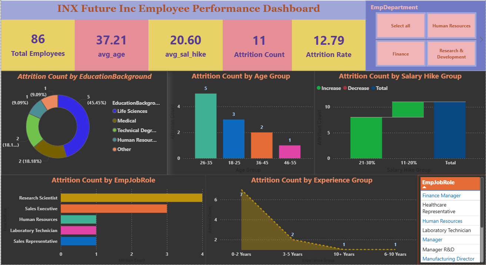

# 📊 Employee Attrition & Performance Dashboard

## 📌 Objective
Analyse employee attrition trends to help HR teams identify
retention risks and improve workforce planning decisions.

## 🛠️ Tools Used
- Microsoft Power BI
- Power Query Editor
- DAX (Data Analysis Expressions)

## 📊 Key Features
- Dynamic slicers to filter by department, age group & job role
- KPI cards showing attrition rate, average salary & experience
- Bar charts, pie charts, donut charts & clustered charts
- Identifies key factors — age, salary hike, education & experience

## 💡 Key Insights
- Employees with low salary hikes showed highest attrition
- Age group 26–35 had the most attrition cases
- Sales job role showed highest dissatisfaction levels
- ## 📸 Dashboard Preview

## 📁 Files
- Employee_Attrition_Dashboard.pbix — Power BI dashboard file

## 👩‍💻 Author
Kandregula Navya — Data Analyst | Bengaluru
📫 navyakandregula98@gmail.com
🔗 www.linkedin.com/in/navyakandregula
